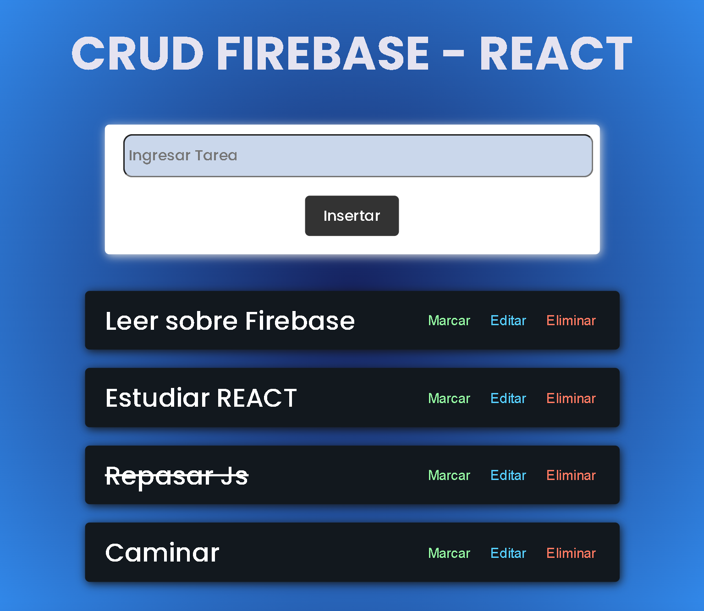
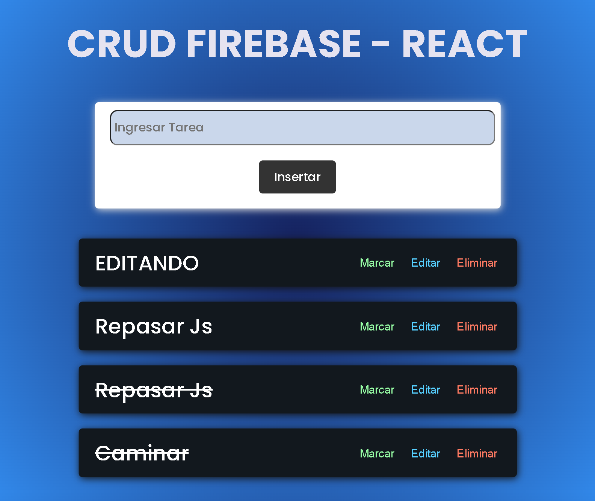

# React - Fundamentos

## Tecnologías Utilizadas:

- React 
- Firebase 

---
## Descripción 📘 

Proyecto de tipo Crud usando Firebase como base de datos de respaldo. Con lo cual podemos crear, editar o eliminar las tareas pendientes.

---
## Login - SignIn - Home 🎨
---

